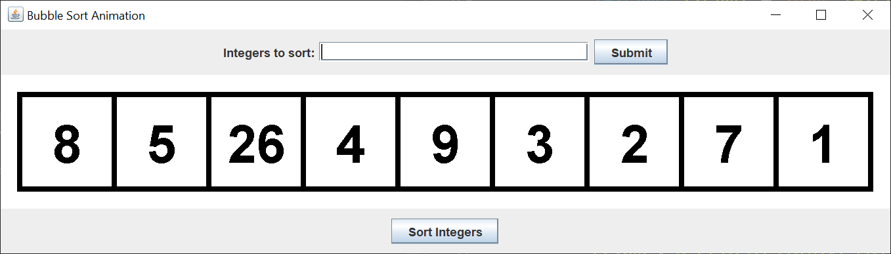
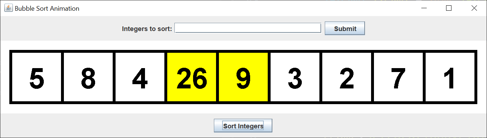
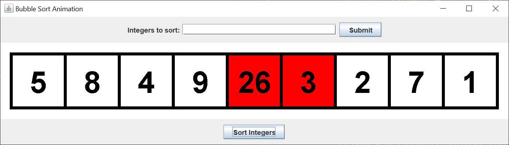
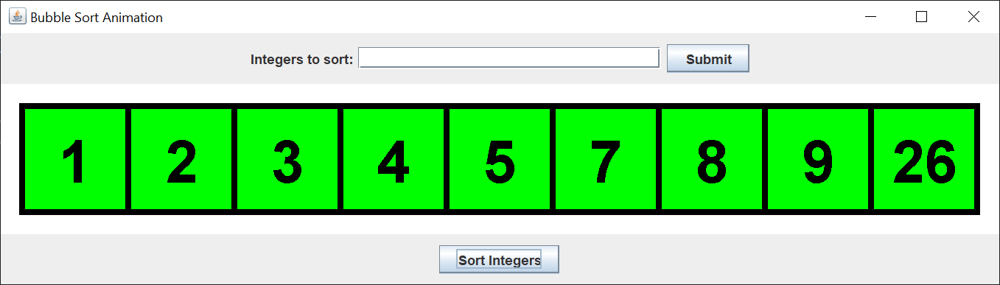

# Bubble Sort Animation

## Introduction

Recently on Stack Overflow, I read a question where the end of semester Java Swing project was to animate a bubble sort.  I thought that would be an interesting mini-project, so I spent a few hours creating the following GUI.

I created an initial integer array to sort.  You can change the initial array by typing a list of integers, separated by a space, in the "Integers to sort" field and left-clicking the Submit button.  The integers can range from -9 to 99.

When you left-click on the Sort Integers button, an animated bubble sort happens.

- A pair of nambers is compared.  The pair being compared is marked with a yellow background.
- If the numbers are not in ascending order, the pair being compared is marked with a red background.
- If the numbers are not in ascending order, the pair of numbers switch positions.

Here's the GUI when a pair of numbers are being compared.

Here's the GUI when a pair of numbers are out of order.

When the array is finally sorted, all of the numbers have a green background.

Don't left click any buttons while the animation is running.  You can exit the application while the animation is running.

## Explanation

If you’re not familiar with Java Swing, Oracle has an excellent tutorial to get you started, [Creating a GUI With JFC/Swing](https://docs.oracle.com/javase/tutorial/uiswing/index.html). Skip the Netbeans section.

The application consists of seven classes, two model classes, a JFrame class, a drawing JPanel, a controller class to update the integer array, a controller class to start the sort animation, and a controller class to increment each step of the bubble sort.

I didn't write this code all at once.  I wrote a little, tested a lot.  Most of the code is standard Swing, except for the controller that increments each step of the bubble sort.  I knew what I had to do and it still took the most time to code and test.

### Model

The model consists of two classes.  The ColorDigit class is a plain Java getter / setter class that holds a digit and a background color.  One interesting method is the copy method, which makes a copy of the ColorDigit instance.  This copy method will be used when swapping digits.  The ColorDigits class holds an array of ColorDigit instances.

### View 

The GUI is made up of an entry JPanel, a drawing JPanel, and a button JPanel.  The entry JPanel holds the JLabel, JTextField, and JButton to update the integer array.  The button JPanel consists of a button to start the sort animation.  The drawing JPanel is an instance of a separate drawing JPanel class.

The drawing JPanel paints the array values with the beckground colors in the ColorDigit array.  The controller classes will update the Colo-rDigit array.

### Controller

The controller class that updates the ColorDigit array simply splits the JTextField String by spaces, and converts the Strings to ints.  If any String does not convert to an int, the drawing JPanel is unchanged.  After all the Strings are converted to int values, the drawing JPanel is updated.  There's no test to see if the int values are between -9 and 99.

The controller class that starts the sort animation starts the sort animation.  You can change the time delay if you want a faster or slower animation.  Don't left-click any JButtons while the animation is running.

The controller class that increments each step of the bubble sort is a bit trickier.  You cannot have any loops inside the ActionListener.  Each step of the bubble sort has to be executed in the ActionListener.  The class keeps track of the start index and the end index of each time through the array.  The state int keeps track of where we are in the display of each bubble sort step.

As you can see, the bubble sort code has to be written to accomodate the Swing GUI.  I suspect this is the step that trips up most students.  It was definitely the class I spent the most time coding and testing.
